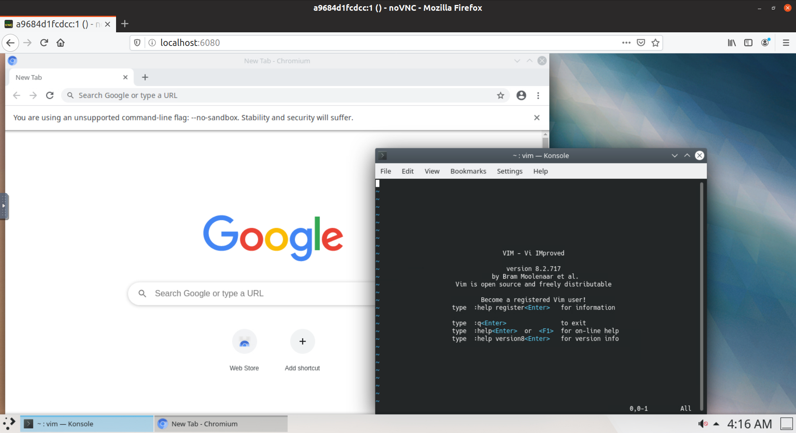

# docker-archlinux-vnc

[](https://hub.docker.com/r/octoberlan/archlinux-vnc)
[](https://hub.docker.com/r/octoberlan/archlinux-vnc)

A docker image of Arch Linux with KDE desktop and VNC support.

## Screenshots




## Pull image

```
docker pull dcsunset/archlinux-vnc
```

The tag can be one of those listed above.

## Usage

Simple usage:

```
docker run -d -p 5900:5900 -p 6080:6080 -e VNC_PASSWORD=password octoberlan/archlinux-vnc
```

Then visit <http://localhost:6080> to visit noVNC UI.
Or you can use a different VNC client (like TigerVNC client)
and connect to localhost:5900.

If `VNC_PASSWORD` is not set,
then the security type of vncserver is set to `ArchTigerVNC`,
it is **insecure** when exposing the container on the Internet.

## Exposed ports

* 5900: Used for VNC interface
* 6080: Used for noVNC Web UI

## Installed applications

<!-- * plasma-meta
* kde-accessibility-meta
* kde-system-meta
* konsole -->
* xfce4
* tigervnc
* noVNC
* wget
* vim
* chromium

## Build

```
docker build -t archlinux-vnc .
```


## Parameters

Container images are configured using parameters passed at runtime (such as those above). These parameters are separated by a colon and indicate `<external>:<internal>` respectively. For example, `-p 8080:80` would expose port `80` from inside the container to be accessible from the host's IP on port `8080` outside the container.

| Parameter | Function |
| :----: | --- |
| `-p 5900` | VNC port |
| `-e VNC_PASSWORD` | Password used to access VNC |
| `-e CUSTOM_RESOLUTIONS="2048x1536,544x662"` | A comma separated list of custom resolutions to add to xrandr |


## FAQ

### Scaling

By default, noVNC's scaling mode is set to None.
It can be changed in the noVNC panel easily.


## License

MIT License
